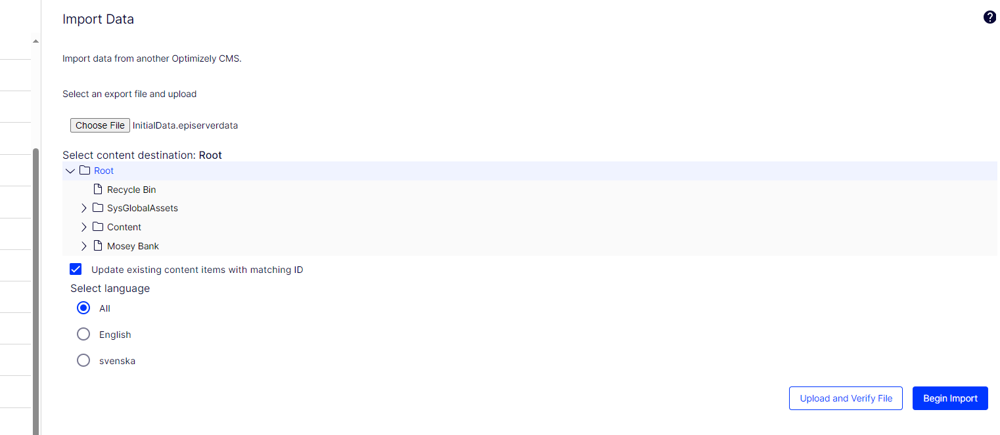
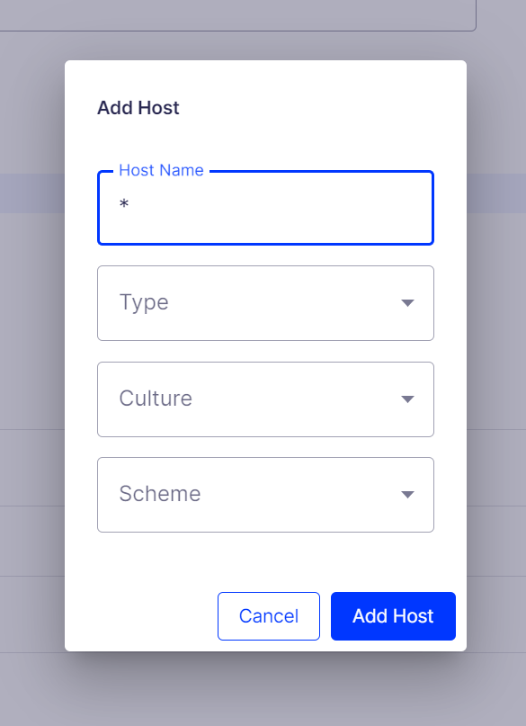

[Back to readme](../README.md)
## Optimizely CMS Configuration
These instructions assume that you've just received the e-mail with login information for the CMS and are able to login to the fresh CMS instance.

### 1. Import the content pack

- Download the [IntialData.episerverdata](../InitialData.episerverdata) file to your local disk, to a place where you can access it.
- Login to the CMS and navigate to "Settings" (cog icon on the left-hand side) - and then go "Import data", under the heading "Tools".
- Import the settings according to the screenshot here

After clicking "Begin Import", you should see a loader during the import. After import, a results section should appear, which summarized the number of imported items.

### 2. Configure the channel
With the content now imported, the next step is to do the initial configuraiton of the channel. This will allow the website to connect to the content and render it.

- Navigate to "Settings" (cog icon on the left-hand side) - and then go to "Manage Websites" under "Config"
- Click on "Create website" to create a new channel definition
- Fill out the form as follows:

| Field | Instruction |
| - | - |
| Name | The name for the channel, use "Mosey Bank" or a name you've selected yourself
| URL | Copy the URL from your browser and remove everything after the domain. So `https://example.cms.optimizely.com/ui/EPIServer.Cms.UI/...` becomes `https://example.cms.optimizely.com/` |
| Start page | Select the start page of the channel, that is "Mosey Bank" for the included content pack |
| Use site-specific assets | Checking this option will allow you to store assets at a channel level. |

- Now click on "Create website", you should go back to the list of sites.
- Click on the ***Name*** of the website you've just created, you should now see same form again, with the settings you've just created **and** the first host defined.
- Click on the "Add Host" button and create the following settings:

| Field | Instruction |
| - | - |
| Host Name | Put in a single asterisk (*) |
| Type | Keep this field empty |
| Culture | Keep this field empty |
| Scheme | Keep this field empty |

- Click on "Add Host" to add this host to the list
- Click on "Save Website" to update the website definition

### 3. Configure the languages
The last step is to have the available languages match the languages in the content pack.

- Navigate to "Settings" (cog icon on the left-hand side) - and then go to "Manage Website Languages" under "Config"
- Using the "triple dot" icon on the left of each item, disable Swedish ("Svenska") and enable Dutch ("Nederlands") and Flemish ("Nederlands (België)")

After configuration the list should look like:

[Back to readme](../README.md)